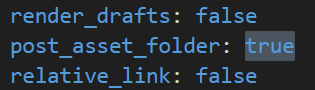
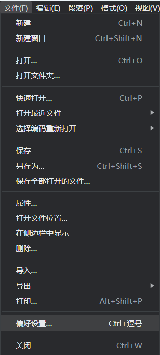
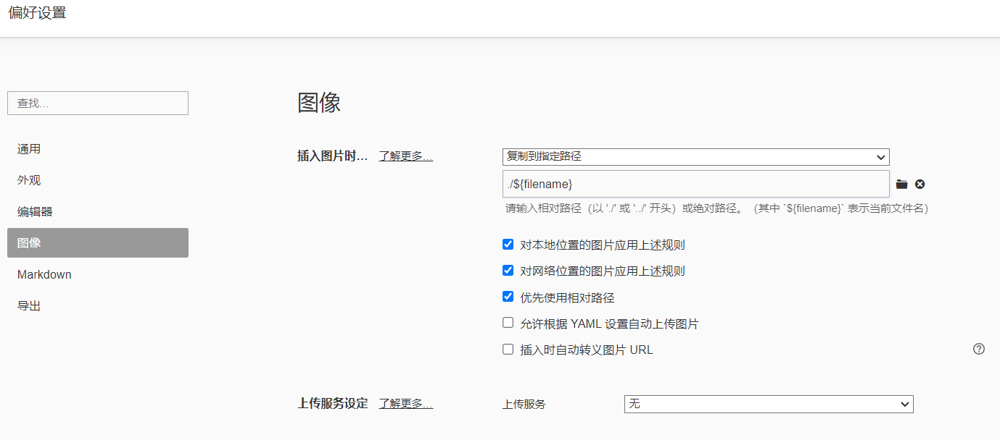
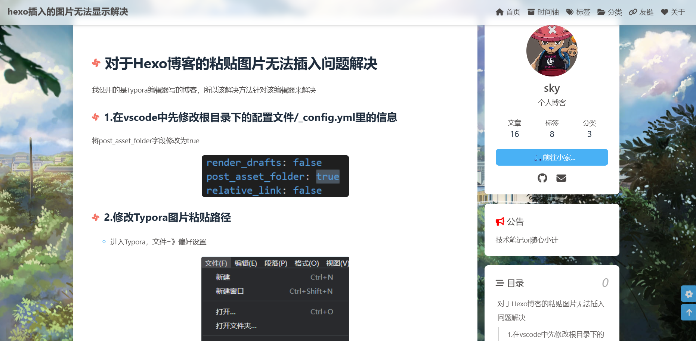

# 对于Hexo博客的粘贴图片无法插入问题解决

我使用的是Typora编辑器写的博客，所以该解决方法针对该编辑器来解决

## 1.在vscode中先修改根目录下的配置文件/_config.yml里的信息

将post_asset_folder字段修改为true



## 2.修改Typora图片粘贴路径

- 进入Typora，文件=》偏好设置



- 将图像设置修改为和我的一致
- 


## 3.打开vscode终端控制台，下载插件

将该条代码放到终端运行

```
npm install hexo-asset-img --save
```


## 4.重新加载，图片显示成功

放到终端运行

```
hexo cl;hexo g;hexo s
```




最终加载到github更新

```java
git add -A
git commit -m "update"
git push
```

```
hexo cl;hexo g;hexo d
```

