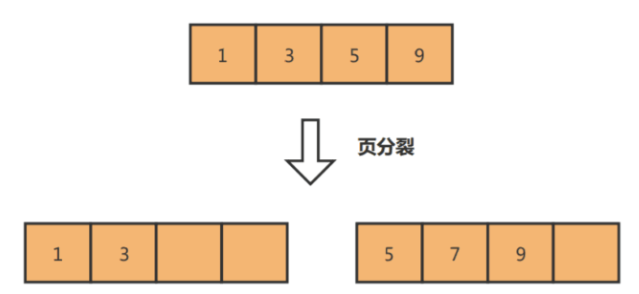

SQL调优可以根据几个方面来讲述：

# 1.索引调优

## 主键索引优化

- 尽量使用自增的值作为主键，当主键是自增的时候，**每条数据都是追加写入**，主键索引的B+树的叶子结点按照主键值顺序从左到右有序排放，写入新数据都会直接放入最右边的叶子结点处。当数据页满了，则开辟一个新的数据页放入结点
- 如果主键不是自增的话，新数据的主键值可能会在数据页中间的某个位置，那么此时就需要移动数据页中的结点来保证新数据插入的有序性，更严重的情况会导致页分裂问题--->需要将数据从旧数据页复制到新数据页，页分裂后果是会导致数据页产生大量内存碎片，索引·结构不紧凑，查询数据时性能降低




##  覆盖索引优化

- 覆盖索引：当查询的字段值在二级索引中存在，就可以使用到覆盖索引直接返回所需的数据，不需要再次回表查询主键索引

- 怎么实现：比如`select id,name,age where name=?`，可以建立（name，age）联合索引，当扫描这个联合索引找到对应的记录时，由于该联合索引中已经存在id（主键值）,name,age这几个字段值数据，直接返回即可，避免多一次回表操作


## 前缀索引优化

针对于一些大字符串字段，可以对该字符串的前几个字符建立前缀索引，使字符串按照前缀有序排放，减小了索引的存储空间，可以使得一个数据页存放更多的索引，加快索引查询


## 防止索引失效

在使用索引过程中，编写SQL语句时尽量避免左模糊查询，左右模糊查询（like %name%)，对索引列计算，使用函数，类型转换，没有遵循联合索引的最左匹配原则，这些情况都会导致索引失效


# 2.SQL层调优

## 分批操作

- 当需要对一大批数据进行操作（增删改查）时，可以使用**循环分页处理**（死循环分页处理，当需要处理的数据为空时则退出循环）的方式，将一大批数据处理分为多个小批数据的处理。避免大事务的发生
- 深分页场景：当limit中偏移量过大时，前面的偏移量都是不需要的数据，`LIMIT 10000,20`会读取10020行然后丢弃前10000行

```java
SELECT id FROM users WHERE condition ORDER BY id LIMIT 10000,20
```

优化思路：记录上一次查询出来的id，作为当前查询的过滤条件；实现效果就像朋友圈一样，数据翻页都是上一条，下一条

将查询到的最后一个id作为下一次分页查询的last_id

```
select id from users ORDER BY id LIMIT 20
```

通过查询到的last_id，可以从该记录开始继续查询后面的数据

```
SELECT * FROM users WHERE id > last_id ORDER BY id LIMIT 20;
```


## order by,group by优化

- 需要使用order by和group by的sql语句，如果排序和分组的字段不存在索引，由于该字段值数据不是有序的，所以会用到using filesort和using temporary（外部排序和使用临时表），这两个操作会涉及到磁盘IO，大大降低操作效率

- 优化：对需要order by和group by的字段建立索引（也可以和其他查询条件中出现的字段建立联合索引），因为索引数据天然就是有序的，所以order by和group by避免的额外操作来保证有序，提高查询效率


## 分解联表查询

联表查询是数据库性能的常见瓶颈，特别是当表数据量大或关联条件复杂时

优化方案：

- 可以对联表查询分解为多个单表查询，在业务层将数据聚合

- 给数据表添加冗余字段，减少联表查询


# 3.数据库连接池调优

**配置参数**：

- 初始连接数：`initialSize`
- 最大连接数：`maxActive`
- 最大等待时间：`maxWait`
- 最小空闲连接：`minIdle`


# 4.MySQL层调优

- **主从复制**：针对于读多写少的场景可以搭建MySQL主从复制
- **分库**：针对写多读少的场景，单库的性能无法抗住高并发流量，就需要进行分库，把并发请求分散到多
  个实例中去。

- **分表**：如果表的数据量很大，比如表数据千万级别了，这时候可以考虑分表了，通过减少每次查询数据
  总量来解决数据查询缓慢的问题。

- **Redis缓存**：对于需要频繁读取的热点数据存入Redis，减小MySQL的查询压力
